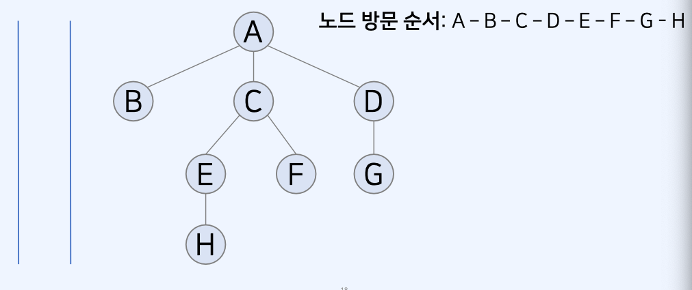

# BFS 알고리즘

## DFS 와 BFS

- 탐색 (Search) 이란 많은 양의 데이터 중에서 **원하는 데이터를 찾는 과정**을 의미한다.
- 대표적인 그래프 탐색 알고리즘으로는 DFS 와 BFS 가 있다.

## js Queue 구현

```js
class Queue {
  constructor() {
    this.items = {};
    this.headIndex = 0;
    this.tailIndex = 0;
  }
  enqueue(item) {
    this.items[this.tailIndex] = item;
    this.tailIndex++;
  }
  dequeue() {
    const item = this.items[this.headIndex];
    delete this.items[this.headIndex];
    this.headIndex++;
    return item;
  }
  peek() {
    return this.items[this.headIndex];
  }
  getLength() {
    return this.tailIndex - this.headIndex;
  }
}

// 구형된 큐 라이브러리 사용
queue = new Queue();

// 5 삽입 - 2 삽입 - 3 삽입 - 7 삽입 - 삭제 - 1 삽입 - 4 삽입 - 삭제
queue.enqueue(5);
queue.enqueue(2);
queue.enqueue(3);
queue.enqueue(7);
queue.dequeue();
queue.enqueue(1);
queue.enqueue(4);
queue.dequeue();

// 먼저 들어온 순서대로 출력
while (queue.getlength() != 0) {
  console.log(queue.dequeue());
}

// 출력
// 3
// 7
// 1
// 4
```

## 너비 우선 탐색(BFS) 이란 ?

- 그래프 혹은 트리에서 모든 노드를 한 번씩 탐색하기 위한 기본적인 방법이다.
- **[완전 탐색]** 을 수행하기 위해 사용할 수 있는 방법 중 하나
- (모든 간선의 길이가 동일할 때) 최단 거리를 탐색하기 위한 목적으로 사용할 수 있다.
- 큐 자료구조를 사용한다.
  -> 기본적으로 DFS 는 스택, BFS 는 큐를 사용한다.

## 너비 우선 탐색(BFS) 기본 동작 방식

- BFS는 다음과 같은 방법으로 동작한다.

1. **시작 노드**를 큐에 넣고 **[방문 처리]** 한다.
2. 큐에서 원소를 꺼내어 방문하지 않은 인접 노드가 있는지 확인한다.

- 있다면, 방문하지 않은 인접 노드를 큐에 모두 삽입하고 [방문 처리]한다.

3. 2번 과정을 더 이산 반복할 수 없을 때까지 반복

## 너비 우선 탐색(BFS) 사용 예시

- 너비 우선 탐색이 사용되는 예시로는 다음과 같은 상황들이 있다.

1. 간선의 비용이 동일한 상황에서 [최단 거리] 문제를 해결하는 경우
2. 완전 탐색을 위해 사용한 DFS 솔루션이 메모리/시간 초과를 받아 BFS로 재시도하는 경우
   -> DFS와 BFS 모두 그래프 탐색 목적으로 사용할 수 있으나, 구현이 익숙하다면 BFS를 추천

## 너비 우선 탐색(BFS) 기본 동작 방식



## 너비 우선 탐색 (BFS)과 최단 경로

- BFS는 간선의 비용이 동일할 때 [최단 거리] 문제를 해결하기 위해 사용 가능
- BFS는 다익스트라 최단 경로 알고리즘과 유사한 특징
  -> 다익스트라는 간선의 비용이 서로 다를 수 있을 때 사용 가능

1. 다익스트라 알고리즘은 일반 큐 대신에 우선순위 큐를 사용
2. 다익스트라는 특정 노드에 대하여 [최단 거리] 값이 갱신될 수 있다. (더 짧은 경로를 찾는 경우)

## 너비 우선 탐색(BFS) 소스 코드 예시

```js
// BFS 메서드 정의
// 이전에 선언한 queue 자료구조를 사용
function bfs(graph, start, visited) {
  queue = new Queue();
  queue.enqueue(start);
  // 현재 노드를 방문 처리
  visited[start] = true;

  // 큐가 빌 때까지 반복
  while (queue.getLength() != 0) {
    // 큐에서 하나의 원소를 뽑아 출력
    v = queue.dequeue();
    console.log(v);
    // 아직 방문하지 않은 인접한 원소들을 큐에 삽입
    for (i of graph[v]) {
      if (!visited[i]) {
        queue.enqueue(i);
        visited[i] = true;
      }
    }
  }
}

// 각 노드가 방문된 정보를 표현
graph = [[], [2, 3, 4], [1], [1, 5, 6], [1, 7], [3, 8], [3], [4], [5]];

// 각 노드가 방문된 정보를 표현
visited = Array(9).fill(false);

// 정의된 BFS 함수 호출
bfs(graph, 1, visited);
```
