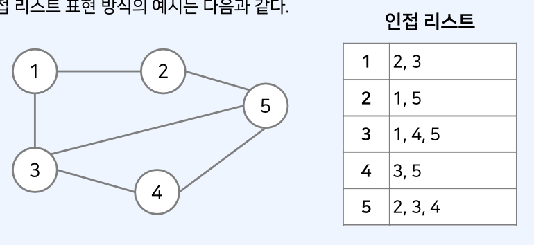
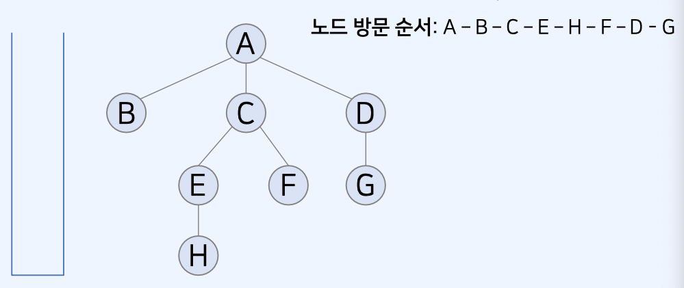

# DFS 알고리즘

## DFS 와 BFS

- 탐색 (Search) 이란 많은 양의 데이터 중에서 **원하는 데이터를 찾는 과정**을 의미한다.
- 대표적인 그래프 탐색 알고리즘으로는 DFS 와 BFS 가 있다.

## 스택 (Stack) 자료구조

- 먼저 들어온 데이터가 나중에 나가는 형식(선입후출)의 자료구조

## 그래프의 표현

- 일반적으로 JS 의 DFS와 같은 그래프 문제를 해결할 때는 ?
- 2차원 배열로 그래프를 표현한다.
- 인접 리스트 표현방식



## 깊이 우선 탐색(DFS) 이란 ?

- 그래프 혹은 트리에서 모든 노드를 한 번씩 탐색하기 위한 기본적인 방법이다.
- **[완전 탐색]** 을 수행하기 위해 사용할 수 있는 가장 간단한 방법 중 하나다.
- 스택 자료구조를 사용

## 깊이 우선 탐색(DFS) 기본 동작 방식

- DFS는 다음과 같은 방법으로 동작한다.

1. **시작 노드**를 스택에 넣고 **[방문 처리]** 한다.
2. 스택에 마지막으로 들어온 노드에 방문하지 않은 인접 노드가 있는지 확인한다.

- 있다면, 방문하지 않은 인접 노드를 스택에 삽입하고 [방문 처리]한다.
- 없다면, 현재 노드(스택에 마지막으로 들어 온 노드)를 스택에서 **추출**한다.

3. 2번 과정을 더 이상 반복할 수 없을 때까지 반복

## 깊이 우선 탐색(DFS) 구현 특징

- DFS를 실제로 구현할 때는 **스택 혹은 재귀 함수**를 이용한다.
  -> 재귀 함수는 내부적으로 스택과 동일한 동작 원리를 가지므로, 구현의 편리성이 존재한다.
- 완전 탐색을 목적으로 하는 경우, 탐색 속도가 **BFS**보다 느린 경향이 있다.
- 그럼에도 구현의 편리성 때문에 BFS 대신에 사용하는 경우 또한 많다.

## 깊이 우선 탐색(DFS) 사용 예시

- 깊이 우선 탐색이 사용되는 예시

1. 더 짧은 코드로 간결히 구현해야 하는 경우
2. 큐 라이브러리를 사용할 수 없는 경우
3. 트리의 순회, 점화식 구현 등 DFS(재귀 구조)에 특화된 문제인 경우
4. 트리에서 최단 거리 탐색을 구하는 경우
   -> 트리에서는 두 노드를 잇는 경로가 하나만 존재

## 깊이 우선 탐색(DFS) 기본 동작 방식



## 깊이 우선 탐색(DFS) 소스 코드 예시

```js
// DFS 메서드 정의
function dfs(graph, v, visited) {
  // 현재 노드를 방문 처리
  visited[v] = true;
  console.log(v);

  // 현재 노드와 연결된 다른 노드를 재귀적으로 방문
  for (let i of graph[v]) {
    if (!visited[i]) dfs(graph, i, visited);
  }
}

// 각 노드가 연결된 정보 표현
graph = [[], [2, 3, 4], [1], [1, 4, 6], [1, 7], [3, 8], [3], [4], [5]];

// 각 노드가 방문된 정보를 표현
visited = new Array(9).fill(false);

// 정의된 DFS 함수 호출
dfs(graph, 1, visited);
```

## 깊이 우선 탐색(DFS) 기본 동작 방식

- 도달 가능한 **[모든 위치]**를 탐색하는 경우를 고려
- DFS: 도달 가능한 끝 위치까지 도달했다면, 다시 최근의 [갈림길]로 돌아가서, 다른 위치로도 가보는 방식과 유사

## DFS를 활용한 완전 탐색

- 흔히 DFS는 모든 노드를 [완전 탐색]하기 위한 방법으로 사용됨.
- 완전 탐색 알고리즘에서는 기본적으로 각 노드 및 간선에 대하여 한번씩 확인하도록 한다.
- DFS를 응용하여 모든 경우의 수를 계산하기 위한 백트래킹(back-tracking) 알고리즘으로 사용할 수 있다. (기본 알고리즘)
  -> 백트래킹에 비하여 기본적인 형태의 DFS는 그 코드 예시가 간단하다.

## 문제 풀이

[바이러스](https://www.acmicpc.net/problem/2606)
[유기농 배추](https://www.acmicpc.net/problem/1012)
