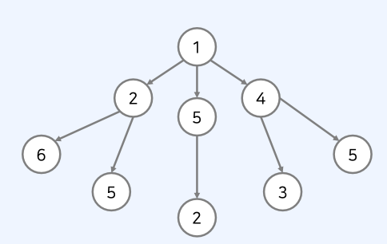

# 그리디 알고리즘 (탐욕 알고리즘) Greedy Algorithm

## 탁욕 알고리즘 (Greedy Algorithm)

- 현재 상황에서 **당장 가장 좋아보이는 상황만을 선택** 하는 알고리즘
- 흔히 그리디 알고리즘, 혹은 탐욕법이라고 부름
- 최적의 해를 구하기 위한 근사적인 방법으로 사용될 때가 많다

## 탐욕 알고리즘 예시

- 루트에서 출발하여 단말 노드까지 가는 경우를 생각한다면
- 거쳐가는 노드의 합이 가장 큰 경우는 ?

- **최적의 해**는 10이다.
- 1 -> 4 -> 5 로 가는 경우가 최적의 해이다.

---

- 매 상황에서 단순히 가장 큰 노드를 선택(탐욕 알고리즘) 하는 경우: 8
- 1 -> 5 -> 2 로 가는 경우

---

- 현실 세계의 많은 상황에서는, 단순한 탐욕 알고리즘으로는 최적의 해를 놓칠 수 있다.
- 하지만, 최적의 해에 가까운 답을 뱉는 것을 고려하면 현실에서의 다양한 프로그램에서 "근사해"를 구하는 목적으로 사용되곤 한다.

### 코딩 테스트에서의 탐욕 알고리즘

- 일반적인 채점 시스템은 시험 참가자의 코드 결과가 정해진 결과와 같은지 확인한다.
- 코딩 테스트에서 탐욕 알고리즘 문제가 출제되는 경우를 생각해보면
- 일반적으로 탐욕 알고리즘 유형에서는, 탐욕 방법으로 최적의 해가 보장되는 문제가 출제된다.

### 탐욕 알고리즘의 접근 방법

- 탐욕 알고리즘 문제를 해결할 때는 일반적으로 다음의 과정을 거친다.

1. 방법 고안하기: 현재 상황에서 어떤 것을 선택할지 알고리즘을 고안한다.
2. 정당성 확인하기: 자신이 고안한 알고리즘이 항상 최적의 해를 보장하는지 확인한다. (증명 단계)

## 문제 예시 - 거스름 돈 문제

- **거스름 돈 문제**는 전형적인 탐욕 알고리즘의 예시
- 카운터에 500원, 100원, 50원, 10원 동전이 무수히 많을 때
- 손님에게 6,480원을 거슬러 주어야 할 때, 동전 개수의 최솟값은 ?

## 문제 해결 - 거스름 돈 문제

- 이 문제의 해결 방법은, **가장 큰 화폐 단위부터 거슬러주는 것**
- 따라서, 다음의 4단계를 거쳐 정답을 도출할 수 있다.

1. 500원으로 거슬러 줄 수 있는 만큼 거슬러 줌
2. 100원으로 거슬러 줄 수 있는 만큼 거슬러 줌
3. 50원으로 거슬러 줄 수 있는 만큼 거슬러 줌
4. 10원으로 거슬러 줄 수 있는 만큼 거슬러 줌

- 총 사용한 동전의 개수는 12 + 4 + 1 + 3 = 20개

### 거스름 돈 문제의 해법 정당성 분석

- 단순히 큰 화폐 단위부터 선택하여 최적의 해를 찾을 수 있는 이유는 무엇일까 ?
- 그 이유는, 각 화폐 단위가 배수 관계에 속하기 때문이다.
  [예시] 120원을 거슬러 주어야 할 때, 80원, 60원, 10원 동전이 있다면 ?
- 최적의 해: 60원 \* 2 = 120원 으로 2개의 동전 필요
- 80원 부터 거슬러 준다면 총 5개의 동전이 필요할 것.

# 탐욕법 문제 풀이

(동전 0)[https://www.acmicpc.net/problem/11047]
