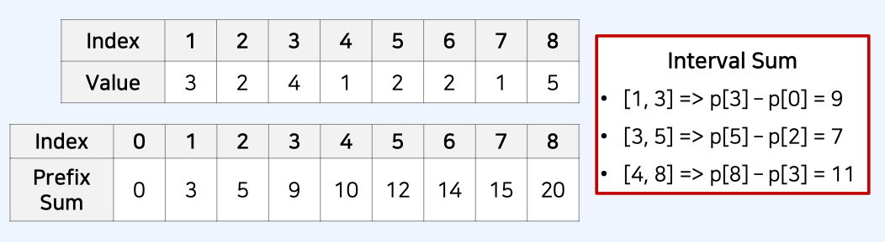

# 누적합 알고리즘

## 누적합 알고리즘 동작 방식

- 구간 합 문제: 나열된 N개의 수가 있을 때 특정 구간의 모든 수를 합한 값을 계산하는 문제
- 예를 들어 5개의 데이터로 구성된 수열 {10, 20, 30, 40, 50} 이 있다고 가정
  - 두 번째 수 부터 네 번째 수까지의 합은 20 + 30 + 40 = 90 이다.

## 누적합 알고리즘 동작 방식

- N개의 정수로 구성된 수열이 있다.
- M개의 쿼리(Query) 정보가 주어진다.
  - 각 쿼리는 Left, Right 로 구성된다.
  - 각 쿼리에 대하여 [Left, Right] 구간에 포함된 데이터들의 합을 출력해야 한다.
- 수행 시간 제한은 **O(N + M)** 이다.

## 누적합 알고리즘 동작 방식

- 접두사 합 (Prefix Sum): 배열의 맨 앞부터 특정 위치까지의 합을 미리 구해 놓은 것
- 접두사 합을 활용한 알고리즘은 다음과 같다.
  - n개의 수 위치 각각에 대하여 접두사 합을 계산하여 P에 저장한다.
  - 매 M개의 쿼리 정보를 확인할 때 구간 합은 p[right] - p[left - 1] 이다.
    

## 누적합 코드 예시

```js
// 데이터의 개수 n 과 데이터 입력
let n = 8;
let data = [3, 2, 4, 1, 2, 2, 1, 5];

// 접두사 합 배열 계산
let sumValue = 0;
let prefixSum = [0];
for (let i of data) {
  sumValue += i;
  prefixSum.push(sumValue);
}

// 구간 합 계산 (4 ~ 8 까지)
let left = 4;
let right = 8;

console.log(prefixSum[right] - prefixSum[left - 1]);
```
