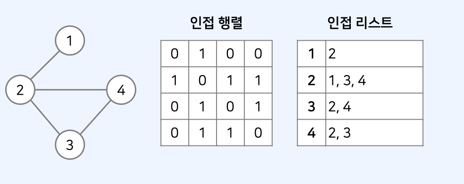
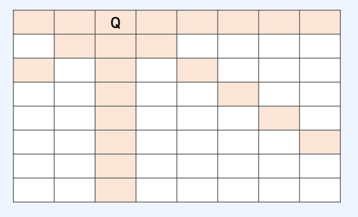
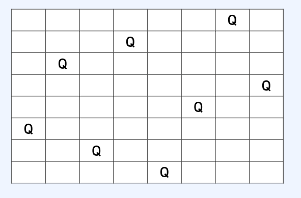
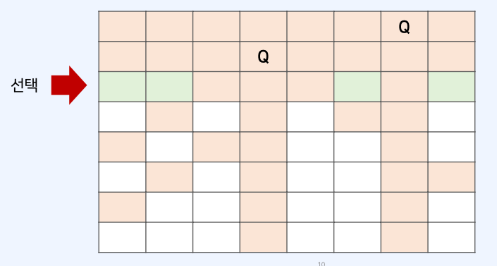
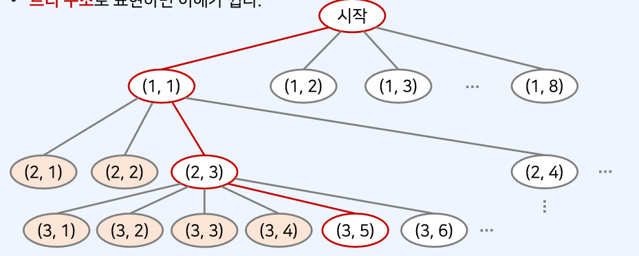
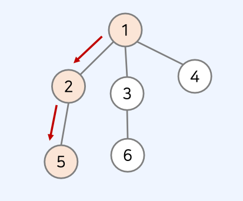

# 백트래킹 알고리즘

## 백트래킹이란 ?

- 일반적으로 그래프/트리의 모든 원소를 **완전 탐색**하기 위한 목적으로 사용할 수 있다.
- DFS와의 차이점

1. DFS는 일반적으로 **완전 탐색**목적으로, 재귀 함수를 이용해 구현한다.
2. 백트래킹도 재귀 함수를 이용해 구현하는 것이 일반적이지만, 단순히 **완전 탐색**하는 것이 아니라 조건에 따라서 유망한 노드로 이동한다.

## 그래프 표현 방식

- 그래프를 표현하는 2가지 방식은 다음과 같다.
  

1. 인접 행렬(Adjacency Matrix)
2. 인접 리스트(Adjacency List)

## N-Queen 문제

- N x N 체스 보드 위에 퀸 N개가 서로 공격할 수 없게 놓는 문제
- 예를 들어 8 x 8 에 하나의 퀸이 놓ㅇ여져 있는 예시는 다음과 같다



- 8 x 8 에 8개의 퀸을 서로 공격할 수 없게 놓는 예시는 다음과 같다



## N-Queen 문제 이해하기

- 예를 들어 N = 8 이라고 해보자.
- 64개의 위치에 8개의 퀸을 설치하는 모든 조합의 수는 Combination(64, 8) 이다.
- 따라서 단순히 모든 경우의 수를 전부 고려한다면 ?
- 각 퀸이 서로 공격이 가능한지 검사하는 방식을 사용한다면 경우의수가 매우 커질 수 있다.

[문제 해결 아이디어]

- 완전 탐색을 하더라도 유망한 경우에 대해서만 탐색을 진행한다면 ?
- 그러한 백트래킹 방식을 사용하여 훨씬 경우의 수를 줄일 수 있다.
- N개의 퀸을 놓기 위해서는 각 행마다 1개씩의 퀸을 놓아야 한다.
- 그러면 1행부터 하나씩 퀸을 놓는다고 생각해보자.

| .                                          |
| ------------------------------------------ |
| 첫째 행에 놓을 수 있는 개수 8 = 2^3개      |
| 둘째 행에 놓을 수 있는 개수 8 = 2^3개      |
| ...                                        |
| 직관적으로 고려한다면, 2^24개 경우가 있다. |

- 하나의 퀸 A가 이미 존재하는 상태에서, 다른 퀸 B 를 놓으려면 어떻게 해야 할까 ?
- 퀸 A의 상하좌우 및 대각선 위치가 아닌 위치에 퀸 B를 놓을 수 있다.



- **트리 구조**로 표현하면 이해가 쉽다.



## N-Queen 문제 해결 방법

- 백트래킹을 진행할 때, 경우의 수를 최대한 줄이는 방법은 ?
  방법: 이전까지 놓았던 퀸들과 상충되지 않는 조건을 만족하는 위치에 대해서만 재귀 함수 호출

1. 재귀 함수를 통해 모든 경우의 수를 다 찾은 뒤에, 각 경우마다 가능한지 검사하는 방법
2. 유망한 경우에 대해서만 재귀 함수를 호출하는 방법

- 위 경우는 2) 방법이 더 효율적

## 백트래킹의 기본 형태

- 백트래킹의 일반적인 코드 형태는 다음과 같다.

```js
function recursive() {
  if (종료 조건을 만족한다면) {
    처리;
  }
  for (자식 노드를 하나씩 확인;) {
    if (임의의 조건을 만족한다면) {
      자식 노드 방문 처리;
      재귀 함수 recursive() 호출;
      자식 노드 방문 처리 해제;
    }
  }
}
```

- 루트 노드에서 자식 노드로 내려간다.
  

## N-Queen 문제 해결 아이디어

- 다만, 이 문제는 가능한 모든 조합의 수를 구하는 것과 같다.
- 매 재귀함수마다 실제로 N x N 모든 위치를 모두 볼 필요는 없다.
  [핵심] 맨 처음 행(row)부터 차례대로 퀸을 놓는다고 생각하면 가짓수를 훨씬 줄일 수 있다.
- N-Queen 문제는 가능한 조합을 계산하는 것이므로, 현재 행의 이전 행으로 돌아갈 필요가 없다.
- 백트래킹은 기본적으로 가능한 노드에 대하여 계속해서 재귀적으로 함수를 호출한다.
- 백트래킹은 **모든 경우의 수**를 탐색하기에 적합하다.
- N-Queen 문제를 해결하기 위해서는 특정 위치의 가능 여부를 판단할 필요가 있다.
- 가능한 노드 여부는 다음의 두 가지를 보면 된다.

1. 같은 행에 있는지 체크: x1 == x2 / 같은 열에 있는지 체크: y1 == y2
2. 대각선에 있는지 체크: abs(x1 - x2) == abs(y1 - y2)

## N-Queen 정답 코드 예시

```js
let n = 8; // 전체 맵 크기
let queens = []; // 현재 체스판에 놓인 퀸의 위치 정보들

function possible(x, y) {
  // (x, y) 위치에 퀸을 놓을 수 있는지 확인
  for (let [a, b] of queens) {
    // 현재까지 놓았던 모든 퀸의 위치를 하나씩 확인하며
    if (a == x || b == y) return false; // 행이나 열이 같다면 놓을 수 없음
    if (Math.abs(a - x) == Math.abs(b - y)) return false; // 대각선에 위치한 경우 놓을 수 없음
  }
  return true;
}

let cnt = 0;
function dfs(row) {
  if (row == n) cnt += 1; // 퀸을 n개 배치할 수 있는 경우 카운트
  for (let i = 0; i < n; i++) {
    // 현재 행에 존재하는 열을 하나씩 확인하며
    if (!possible(row, i)) continue; // 현재 위치에 놓을 수 없다면 무시
    queens.push([row, i]); // 현재 위치에 퀸을 놓기
    dfs(row + 1); // 재귀 함수 호출
    queens.pop(); // 현재 위치에서 퀸을 제거
  }
}

dfs(0);
console.log(cnt);
```
