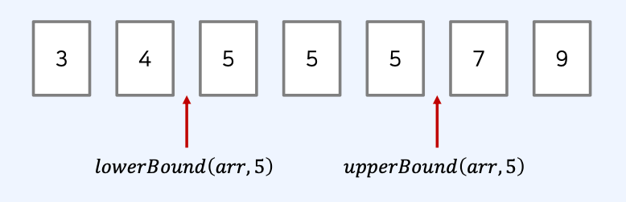
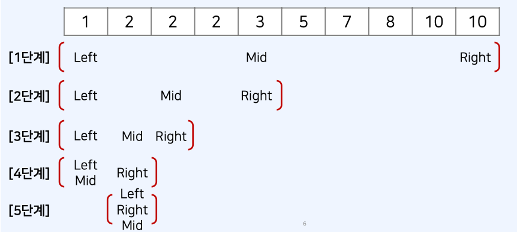
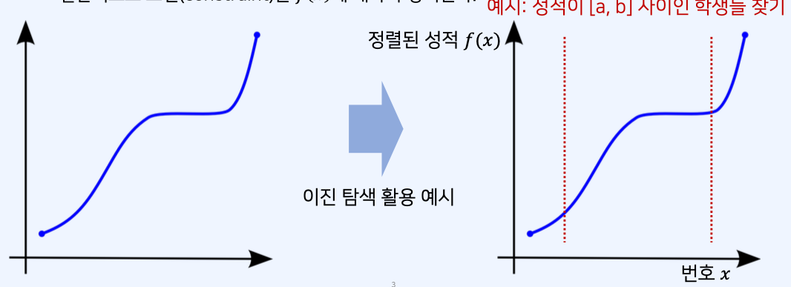
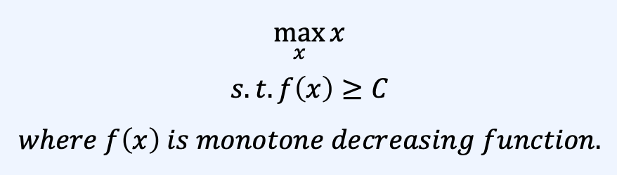

# 이진탐색 알고리즘

## 순차 탐색 vs 이진 탐색

- 아래의 리스트에서 **값이 12인 원소**의 위치를 찾고자 한다. 어떻게 찾을 수 있을까 ?
- 순차 탐색 : 리스트 안에 있는 특정한 데이터를 찾기 위해 앞에서부터 하나씩 확인한다.
  
- 탐색을 위한 시간 복잡도: O(N)

- 이진 탐색: 정렬되어 있는 리스트에서 탐색 범위를 절반씩 좁혀가며 데이터를 탐색한다.
- 탐색을 위한 시간 복잡도: O(logN)

## 이진 탐색(Binary Search) 동작 확인

- 아래의 리스트에서 **값이 12인 원소**의 위치를 찾고자 한다.
- 이진 탐색을 수행할 때는 **시작점(left)**와 **끝점(end)**을 기준으로 탐색 범위를 명시한다.
  

## 이진 탐색의 시간 복잡도

- 각 단계마다 탐색 범위를 2로 나누는 것으로 이해할 수 있다.
- 이상적인 경우 매 단계마다 범위가 반으로 감소하므로, 로그(log) 복잡도를 가진다.

## 이진 탐색 문제 유형의 대표적인 사례

- 이진 탐색은 다음과 같은 사례에서 효과적으로 사용할 수 있다.

1. **매우 넓은(억 단위 이상) 탐색 범위**에서 최적의 해를 찾아야 하는 경우
2. 데이터를 정렬한 뒤에 다수의 쿼리(query)를 날려야 하는 경우

## 이진 탐색 코드 예시 (재귀 함수)

```js
// 이진 탐색 소스코드 구현 (재귀 함수)
function binarySearch(arr, target, start, end) {
  if (start > end) return -1;
  let mid = parseInt((start + end) / 2);
  // 찾은 경우 중간점 인덱스 반환
  if (arr[mid] === target) return mid;
  // 중간점의 값보다 찾고자 하는 값이 작은 경우 왼쪽 확인
  else if (arr[mid] > target) return binarySearch(arr, target, start, mid - 1);
  // 중간점의 값보다 찾고자 하는 값이 큰 경우 오른쪽 확인
  else return binarySearch(arr, target, mid + 1, end);
}

// n(원소의 개수) 와 target(찾고자 하는 값)
let n = 10;
let target = 7;
arr = [1, 3, 5, 7, 9, 11, 13, 15, 17, 19];

// 이진 탐색 수행 결과 출력
let result = binarySearch(arr, target, 0, n - 1);
if (result === -1) {
  console.log("원소가 존재하지 않습니다.");
} else {
  console.log(result + 1);
}
```

## 이진 탐색 코드 예시 (반복문)

```js
// 이진 탐색 소스코드 구현 (반복문)
function binarySearch(arr, target, start, end) {
  while (start <= end) {
    let mid = parseInt((start + end) / 2);
    // 찾은 경우 중간점 인덱스 반환
    if (arr[mid] === target) return mid;
    // 중간점의 값보다 찾고자 하는 값이 작은 경우 왼쪽 확인
    else if (arr[mid] > target) end = mid - 1;
    // 중간점의 값보다 찾고자 하는 값이 큰 경우 오른쪽 확인
    else start = mid + 1;
  }
  return -1;
}

// n(원소의 개수) 와 target(찾고자 하는 값)
let n = 10;
let target = 7;
arr = [1, 3, 5, 7, 9, 11, 13, 15, 17, 19];

// 이진 탐색 수행 결과 출력
let result = binarySearch(arr, target, 0, n - 1);
if (result === -1) {
  console.log("원소가 존재하지 않습니다.");
} else {
  console.log(result + 1);
}
```

# 정렬된 배열에서 특정 원소의 개수 구하기

[값이 특정 범위에 속하는 원소의 개수 구하기]

- 코테에서는 정렬된 배열에서 값이 특정 범위에 해당하는 원소의 개수를 계산하는 것을 요구하는 경우가 종종 있다.
- 이러한 문제를 해결하기 위해 lowerBound() 함수와 upperBound() 함수를 사용할 수 있다.

## 하한선과 상한선 함수

- 아래의 2가지 이진 탐색 함수가 제공하는 기능을 이해할 필요가 있다.
- lowerBound(arr, x): 정렬된 순서를 유지하면서 배열 arr에 x를 넣을 가장 왼쪽 인덱스를 반환
- upperBound(arr, x): 정렬된 순서를 유지하면서 배열 arr에 x를 넣을 가장 오른쪽 인덱스를 반환
  

```js
// 정렬된 순서를 유지하면서 배열에 삽입할 가장 왼쪽 인덱스 반환
function lowerBound(arr, target, start, end) {
  while (start < end) {
    let mid = parseInt((start + end) / 2);
    if (arr[mid] >= target) end = mid; // 최대한 왼쪽으로 이동
    else start = mid + 1;
  }
  return end;
}

// 정렬된 순서를 유지하면서 배열에 삽입할 가장 오른쪽 인덱스 반환
function upperBound(arr, target, start, end) {
  while (start < end) {
    let mid = parseInt((start + end) / 2);
    if (arr[mid] > target) end = mid; // 최대한 오른쪽으로 이동
    else start = mid + 1;
  }
  return end;
}
```

## 하한선(Lower Bound) 함수

- lowerBound(arr, 2) 의 동작 과정 확인
- 동일한 값을 가지는 원소가 여러 개 라면, 최대한 왼쪽으로 탐색 범위를 이동시킨다.
  

## 정렬된 배열에서 특정 원소의 개수 구하기

- countByRange(): 정렬된 배열에서 값이 특정 범위에 속하는 원소의 개수를 계산
- 앞서 정의한 lowerBound() 함수와 upperBound() 함수를 이용해 구현 가능

```js
// 값이 [leftValue, rightValue] 인 데이터의 개수를 반환 하는 함수
function countByRange(arr, leftValue, rightValue) {
  // 유의 : lowerBound와 upperBound()는 end 변수의 값을 배열의 길이로 설정
  let rightIndex = upperBound(arr, rightValue, 0, arr.length);
  let leftIndex = lowerBound(arr, leftValue, 0, arr.length);
  return rightIndex - leftIndex;
}

// 배열 선언
let arr = [1, 2, 3, 3, 3, 3, 4, 4, 8, 9];
// 값이 4인 데이터 개수 출력
console.log(countByRange(arr, 4, 4)); // 2
// 값이 [-1, 3] 범위에 있는 데이터 개수 출력
console.log(countByRange(arr, -1, 3)); // 6
```

# 파라메트릭 서치(Parametric Search)

## 파라메트릭 서치 이해하기

- **이진 탐색 조건**: 변경할(최적화할) 값 x 에 대하여 f(x) 가 단조 증가 혹은 단조 감소
  - 단조 증가 함수: x <= y 이면 f(x) <= f(y) 인 경우
  - 일반적으로 조건 (constraint)은 f(x) 에 대하여 정의 된다.



## 파라메트릭 서치(Parametric Search) 란 ?

- 최적화 문제를 결정 문제('예' 혹은 '아니오') 로 바꾸어 해결하는 기법.
  - 예시: 특정한 조건을 만족하는 가장 알맞은 값을 빠르게 찾는 최적화 문제
- 일반적으로 코딩 테스트에서 파라메트릭 서치 문제는 이진 탐색을 이용하여 해결가능
  - 파라메트릭 서치 문제의 목적 함수 예시:



### 파라메트릭 문제

[예산](https://www.acmicpc.net/problem/2512)
