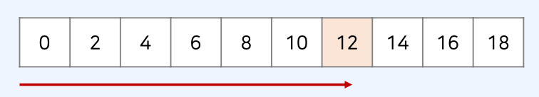
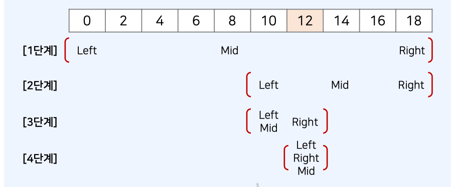

# 이진탐색 알고리즘

## 순차 탐색 vs 이진 탐색

- 아래의 리스트에서 **값이 12인 원소**의 위치를 찾고자 한다. 어떻게 찾을 수 있을까 ?
- 순차 탐색 : 리스트 안에 있는 특정한 데이터를 찾기 위해 앞에서부터 하나씩 확인한다.
  
- 탐색을 위한 시간 복잡도: O(N)

- 이진 탐색: 정렬되어 있는 리스트에서 탐색 범위를 절반씩 좁혀가며 데이터를 탐색한다.
- 탐색을 위한 시간 복잡도: O(logN)

## 이진 탐색(Binary Search) 동작 확인

- 아래의 리스트에서 **값이 12인 원소**의 위치를 찾고자 한다.
- 이진 탐색을 수행할 때는 **시작점(left)**와 **끝점(end)**을 기준으로 탐색 범위를 명시한다.
  

## 이진 탐색의 시간 복잡도

- 각 단계마다 탐색 범위를 2로 나누는 것으로 이해할 수 있다.
- 이상적인 경우 매 단계마다 범위가 반으로 감소하므로, 로그(log) 복잡도를 가진다.

## 이진 탐색 문제 유형의 대표적인 사례

- 이진 탐색은 다음과 같은 사례에서 효과적으로 사용할 수 있다.

1. **매우 넓은(억 단위 이상) 탐색 범위**에서 최적의 해를 찾아야 하는 경우
2. 데이터를 정렬한 뒤에 다수의 쿼리(query)를 날려야 하는 경우

## 이진 탐색 코드 예시 (재귀 함수)

```js
// 이진 탐색 소스코드 구현 (재귀 함수)
function binarySearch(arr, target, start, end) {
  if (start > end) return -1;
  let mid = parseInt((start + end) / 2);
  // 찾은 경우 중간점 인덱스 반환
  if (arr[mid] === target) return mid;
  // 중간점의 값보다 찾고자 하는 값이 작은 경우 왼쪽 확인
  else if (arr[mid] > target) return binarySearch(arr, target, start, mid - 1);
  // 중간점의 값보다 찾고자 하는 값이 큰 경우 오른쪽 확인
  else return binarySearch(arr, target, mid + 1, end);
}

// n(원소의 개수) 와 target(찾고자 하는 값)
let n = 10;
let target = 7;
arr = [1, 3, 5, 7, 9, 11, 13, 15, 17, 19];

// 이진 탐색 수행 결과 출력
let result = binarySearch(arr, target, 0, n - 1);
if (result === -1) {
  console.log("원소가 존재하지 않습니다.");
} else {
  console.log(result + 1);
}
```

## 이진 탐색 코드 예시 (반복문)

```js
// 이진 탐색 소스코드 구현 (반복문)
function binarySearch(arr, target, start, end) {
  while (start <= end) {
    let mid = parseInt((start + end) / 2);
    // 찾은 경우 중간점 인덱스 반환
    if (arr[mid] === target) return mid;
    // 중간점의 값보다 찾고자 하는 값이 작은 경우 왼쪽 확인
    else if (arr[mid] > target) end = mid - 1;
    // 중간점의 값보다 찾고자 하는 값이 큰 경우 오른쪽 확인
    else start = mid + 1;
  }
  return -1;
}

// n(원소의 개수) 와 target(찾고자 하는 값)
let n = 10;
let target = 7;
arr = [1, 3, 5, 7, 9, 11, 13, 15, 17, 19];

// 이진 탐색 수행 결과 출력
let result = binarySearch(arr, target, 0, n - 1);
if (result === -1) {
  console.log("원소가 존재하지 않습니다.");
} else {
  console.log(result + 1);
}
```
