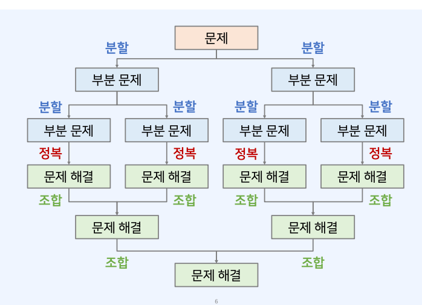
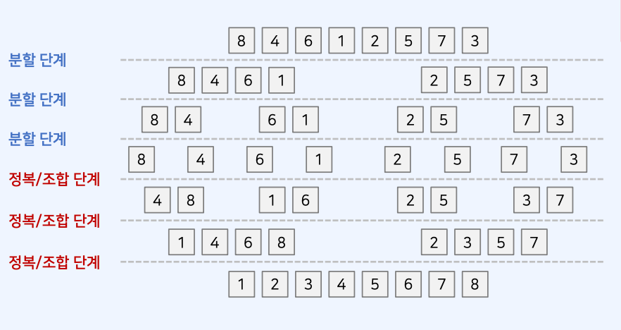

# 병합 정렬 (Merge Sort)

- 병합 정렬은 전형적인 **분할 정복(divide and conquer)** 알고리즘 이다.

## 분할 정복 (Divide and Conquer)

1. 분할 (divide): 큰 문제를 작은 부분 문제(쉬운 문제)로 분할 한다.
2. 정복 (conquer): 작은 부분 문제를 각각 해결한다.
3. 조합 (combine): 해결한 부분 문제의 답을 이용하여 다시 큰 문제를 해결한다.

- 분할 정복은 일반적으로 재귀함수를 이용하여 구현한다.
- 그 이유는 큰 문제를 작은 문제로 "분할하는 방식이 동일한" 경우가 많기 때문이다.
- 더 이상 쪼갤 수 없는 크기가 될 때까지 계속하여 분할 한다.

## 분할 정복의 일반적인 수행 과정



## 분할 정복의 단점

- **일반적으로 재귀 함수를 사용**한다는 점에서 함수 호출 횟수가 많이 발생한다.
- 이는 오버헤드(overhead)로 이어진다.

## 병합 정렬의 특징

- 시간 복잡도 O(NlogN)을 보장하는 빠른 정렬 알고리즘 중 하나.

## 병합 정렬의 동작 방식

- 병합 정렬은 분할 정복을 이용하는 가장 기본적인 정렬 알고리즘

1. 분할(divide): 정렬할 배열(큰 문제)을 같은 크기의 부분 배열(작은 문제) 2개로 분할한다.
2. 정복(conquer): 부분 배열을 정렬 한다. (작은 문제를 해결한다.)
3. 조합(combine): 정렬된 부분 배열을 하나의 배열로 다시 병합한다.



- 분할(Divide): 분할 작업은 단순히 배열의 크기를 절반으로 쪼개는 것이다.
- 정복(Conquer): 두 개의 부분 배열을 "정렬된 하나의 배열"로 만든다.

## 병합 정렬의 시간 복잡도 (Time Complexity)

- 직관적으로 생각했을 때, 높이가 O(logN) 이고, 너비가 O(N) 인 정사각형과 유사하다.
- 따라서 최악의 경우 시간 복잡도는 O(NlogN) 이다.
- 장점: 최악의 경우에도 O(NlogN)을 보장할 수 있다는 점에서 효율적
- 단점: 일반적인 경우, 정복(conquer) 과정에서 임시 배열이 필요하다.

## 병합 정렬 소스 코드

```js
// 병합 (merge) 수행 함수
function merge(arr, left, mid, right) {
  let i = left;
  let h = mid + 1;
  let k = left; // 결과 배열의 인덱스
  while (i <= mid && j <= right) {
    if (arr[i] <= arr[j]) sorted[k++] = arr[i++];
    else sorted[k++] = arr[j++];
  }
  // 왼쪽 배열에 대한 처리가 다 끝난 경우
  if (i > mid) {
    for (; j <= rigth; j++) sorted[k++] = arr[j];
  }
  // 오른쪽 배열에 대한 처리가 다 끝난 경우
  else {
    for (; i <= mid; i++) sorted[k++] = arr[i];
  }
  // 정렬된 배열 결과를 원본 배열에 반영
  for (let x = left; x <= right; x++) {
    arr[x] = sorted[x];
  }
}
```

```js
// 병합 정렬 (merge sort) 함수
function mergeSort(arr, left, right) {
  // 원소가 1개인 경우, 해당 배열은 정렬이 된 상태로 이해 가능
  if (left < right) {
    // 원소가 2개 이상이라면
    let mid = parseInt((left + right) / 2); // 2개의 부분 배열로 분할 (divide)
    mergeSort(arr, left, mid); // 왼쪽 부분 배열 정렬 수행 (conquer)
    mergeSort(arr, mid + 1, right); // 오른쪽 부분 배열 정렬 수행 (conquer)
    merge(arr, left, mid, right); // 정렬된 2개의 배열을 하나로 병합 (combine)
  }
}
```

```js
/* 1) 병합 정렬의 수행 시간 측정 */
// 0부터 999까지의 정수 100000개를 담은 배열 생성
let arr = Array.from({ length: 100000 }, () =>
  Math.floor(Math.random() * 1000)
);

// getTime(): 1970-01-01부터의 시간차를 ms 단위로 계산
startTime = new Date().getTime();
// 임시 정렬 배열(sorted) 정의
sorted = Array.from({ length: arr.length }, () => 0);
mergeSort(arr, 0, arr.length - 1);
endTime = new Date().getTime();

// 시간차 출력
console.log("병합 정렬 소요 시간:", endTime - startTime, "ms.");

/* 2) 이미 정렬된 배열에 대한 병합 정렬의 수행 시간 측정 */
// 값이 7인 정수 100000개를 담은 배열 생성
arr = Array.from({ length: 100000 }, () => 7);

// getTime(): 1970-01-01부터의 시간차를 ms 단위로 계산
startTime = new Date().getTime();
// 임시 정렬 배열(sorted) 정의
sorted = Array.from({ length: arr.length }, () => 0);
mergeSort(arr, 0, arr.length - 1);
endTime = new Date().getTime();

// 시간차 출력
console.log(
  "정렬된 배열에 대한 병합 정렬 소요 시간:",
  endTime - startTime,
  "ms."
);

// 결과
// 병합 정렬 소요 시간: 183 ms.
// 정렬된 배열에 대한 병합 정렬 소요 시간: 167 ms.
```

- 이전 알고리즘과는 다르게 시간이 매우 단축 되었다.
